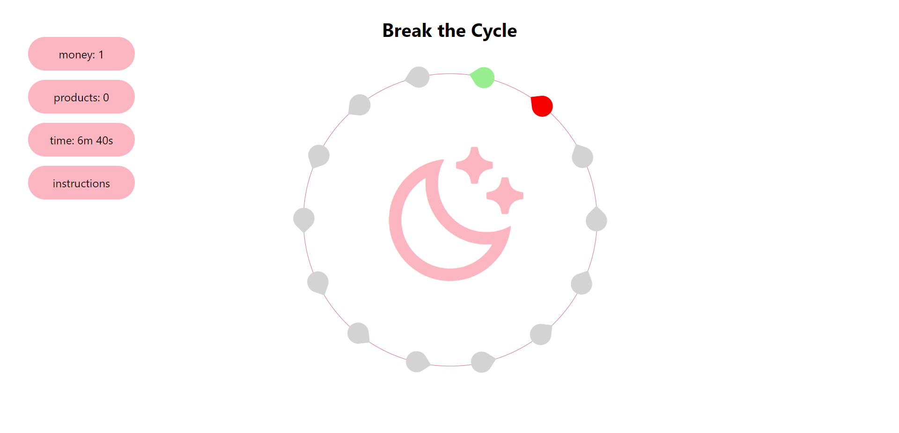
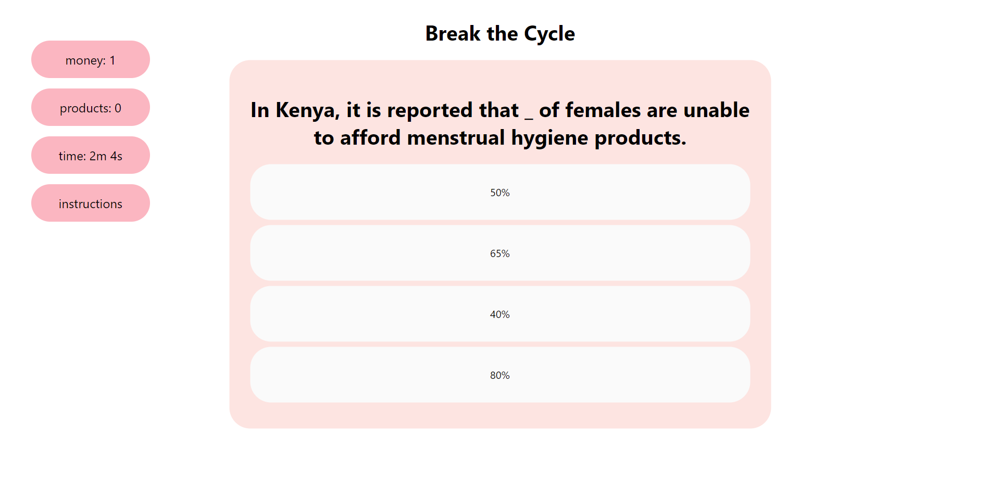

# Break the Cycle

**inspiration**
Period poverty is the inadequate access to menstrual hygiene tools and education. This issue affects people all over the globe, including the US. Period poverty has been shown to directly affect a girl’s potential to succeed. If a girl misses school every time she has her period, she is set 145 days behind her male counterparts. Most girls in the developing world choose to drop out of school altogether rather than face the embarrassment and shame of being unprepared for their cycles. The stigma that still continues to surround a completely natural bodily process prevents the issue of period poverty to be solved. Not everyone can donate or volunteer with organizations, but everyone can educate themselves and help spread awareness. In this game, there are 14 drops for 14 questions about menstruation and period poverty. The user must answer questions correctly to earn money for purchasing period products. The user must collect 4 products before the time (7 minutes) is over. The collection points are not revealed until the user clicks on the drop. If there is time left and the user has yet to collect 4 products, the cycle will begin again - but the collection points will be different. The user should make sure to read the answers so that they can remember the answers for possible future cycles.

**what the app does**
The goal is for the user to become more educated about menstruation and period poverty. The timed nature of the game reflects the time that girls lose at school due to their inability to access period products or proper menstruation knowledge. At the end of the game, the website displays a few ways in which the user can contribute to ending/diminishing period poverty.




## Installation

In the project directory, you can run:
```npm i && npm start```
or alternatively
```npm i```
then 
```npm start```

View in your browser: [http://localhost:3000](http://localhost3000)
